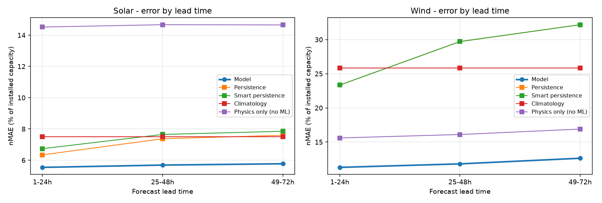

# Forecast benchmark

Phase 1 core model: 24-72 hour solar and wind power forecasting.

Every number below is computed on a **contiguous final time block that no model or
baseline saw during fitting**. Splits are never shuffled: weather is strongly
autocorrelated hour to hour, so a random split lets a model see the afternoon while
predicting the morning and reports an error far below anything achievable in operation.

Errors are normalised by **installed capacity**, not by mean output. Normalising by the
mean flatters solar heavily, because half the rows are night.

The headline is **skill against smart persistence** - holding the clear-sky index constant
from issue time. Plain persistence is easy to beat and proves nothing; smart persistence
already reproduces the entire diurnal and seasonal shape, so beating it is the claim worth
making. **Physics only** matters equally here: the model receives the physical estimate as
an input feature, so that column measures exactly what the learned correction adds.

## Solar

Trained on 1,566,552 rows from 72 sites
(2025-05-01 to 2026-08-31),
evaluated on 505,656 untouched holdout rows from 2026-07-01 onward.
The corpus carries genuine 24-72 h leads.

### Overall, holdout

| Method | nMAE %cap | nRMSE %cap | Bias %cap | R2 | Skill vs smart persistence % |
|---|---:|---:|---:|---:|---:|
| **Model (quantile GBDT)** | 5.67 | 12.39 | -0.70 | 0.79 | 23.55 |
| Persistence | 7.10 | 15.73 | 0.23 | 0.63 | 4.18 |
| Smart persistence | 7.41 | 15.91 | 1.15 | 0.63 | 0.00 |
| Climatology | 7.51 | 14.95 | 0.35 | 0.66 | -1.31 |
| Physics only (no ML) | 14.61 | 27.12 | -10.41 | -0.10 | -97.16 |

Mean pinball loss on the dimensionless target: **0.0171**
(p10 0.0128, p50 0.0283, p90 0.0100).

Prediction interval coverage (p10-p90): **91.5%**
against a nominal 80%, with a mean width of 18.1% of capacity.

### By lead time

| Lead | n | Model nMAE | Persistence | Smart persist. | Climatology | Physics only | Skill % | PICP % |
|---|---:|---:|---:|---:|---:|---:|---:|---:|
| 1-24h | 168552 | 5.54 | 6.34 | 6.74 | 7.51 | 14.52 | 17.76 | 91.61 |
| 25-48h | 168552 | 5.69 | 7.37 | 7.65 | 7.51 | 14.67 | 25.62 | 91.31 |
| 49-72h | 168552 | 5.77 | 7.60 | 7.85 | 7.51 | 14.65 | 26.49 | 91.45 |
| all | 505656 | 5.67 | 7.10 | 7.41 | 7.51 | 14.61 | 23.55 | 91.46 |

Top features by gain: ghi_wm2_lead1, solar_zenith, solar_elevation, site_latitude, ghi_wm2_lead2, site_tilt, cloud_total_roll_mean, site_capacity_mw.

## Wind

Trained on 1,675,767 rows from 79 sites
(2025-05-01 to 2026-08-31),
evaluated on 554,775 untouched holdout rows from 2026-07-01 onward.
The corpus carries genuine 24-72 h leads.

### Overall, holdout

| Method | nMAE %cap | nRMSE %cap | Bias %cap | R2 | Skill vs smart persistence % |
|---|---:|---:|---:|---:|---:|
| **Model (quantile GBDT)** | 11.91 | 17.53 | 1.89 | 0.79 | 58.09 |
| Persistence | 28.41 | 38.06 | -0.13 | -0.12 | 0.00 |
| Smart persistence | 28.41 | 38.06 | -0.13 | -0.12 | 0.00 |
| Climatology | 25.86 | 30.80 | -2.65 | 0.27 | 8.98 |
| Physics only (no ML) | 16.20 | 24.46 | 5.87 | 0.61 | 42.98 |

Mean pinball loss on the dimensionless target: **0.0374**
(p10 0.0246, p50 0.0595, p90 0.0280).

Prediction interval coverage (p10-p90): **79.2%**
against a nominal 80%, with a mean width of 38.2% of capacity.

### By lead time

| Lead | n | Model nMAE | Persistence | Smart persist. | Climatology | Physics only | Skill % | PICP % |
|---|---:|---:|---:|---:|---:|---:|---:|---:|
| 1-24h | 184925 | 11.29 | 23.34 | 23.34 | 25.86 | 15.60 | 51.62 | 79.19 |
| 25-48h | 184925 | 11.80 | 29.71 | 29.71 | 25.86 | 16.10 | 60.27 | 79.31 |
| 49-72h | 184925 | 12.63 | 32.18 | 32.18 | 25.86 | 16.90 | 60.76 | 79.07 |
| all | 554775 | 11.91 | 28.41 | 28.41 | 25.86 | 16.20 | 58.09 | 79.19 |

Top features by gain: wind_speed_100m_roll_mean, wind_speed_100m, wind_speed_100m_lead1, ws_corrected_roll_mean, ws_hub, site_capacity_mw, site_specific_power, pressure_hpa.

## Forecast lead time: what is and is not measured

GEFCom2014 supplies a single day-ahead forecast run per day, so the horizons genuinely
present in this data are 1-24 h. It cannot, on its own, evidence skill at 48 or 72 h.

This is handled deliberately rather than papered over. The GBDT learns power = f(weather),
which is horizon-agnostic: what degrades with lead time is the *accuracy of the weather
input*, not the weather-to-power mapping. Lead-dependent behaviour is therefore supplied
separately, by calibrating how NWP error grows from lead 1 to lead 3 against Open-Meteo
Previous Runs, and widening the predictive interval accordingly. The evaluation report
states which numbers are measured on GEFCom holdout and which come from that calibration.

## Known limitations

**Domain shift.** The models are trained on GEFCom2014 - Australian plants, ECMWF forecast
fields, 2012-2014 - and served on Open-Meteo ICON forecasts for Indian sites. The design
mitigates this deliberately rather than ignoring it: targets are dimensionless, features
are expressed in source-agnostic physical units, and the physical estimate is an input, so
the model degrades toward physics rather than toward nonsense when it meets conditions
unlike its training set. It is still a real gap, and it is the first thing Phase 2 closes
once measured Gujarat plant data is available. The reported accuracy is measured on
Australian holdout data and should not be read as a measured Gujarat accuracy.

**Estimated coordinates.** GEFCom2014 anonymises its sites, so the solar clear-sky
reference relies on coordinates recovered from each plant's own generation record - solar
noon timing for longitude, the seasonal day-length swing for latitude. The recovered
day-length curves match to under 0.25 h RMSE across the year, but they remain estimates.

**Wind has no thermodynamic inputs in training.** The GEFCom wind track supplies only wind
components, so air density is constant throughout training and the trainer drops it. At
serve time the density correction is active, applied inside the hub-height wind speed,
where it is a physically-correct refinement rather than a learned effect.

